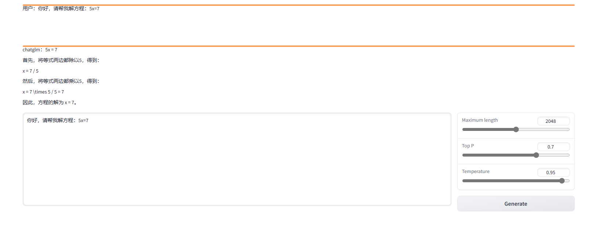

# JittorLLM

### WebDemo

JittorLLM通过gradio库，允许用户在浏览器之中和大模型直接进行对话。

~~~bash
python web_demo.py chatglm
~~~

可以得到下图所示的结果。

### 后端服务部署

JittorLLM在api.py文件之中，提供了一个架设后端服务的示例。

~~~bash
python api.py chatglm
~~~

接着可以使用如下代码进行直接访问

~~~python
post_data = json.dumps({'prompt': 'Hello, solve 5x=13'})
print(json.loads(requests.post("http://0.0.0.0:8000", post_data).text)['response'])
~~~